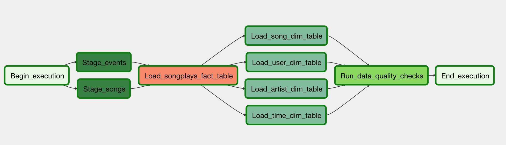

# Airflow Data Pipelines
A music streaming company, Sparkify, has decided that it is time to introduce more automation and monitoring to their data warehouse ETL pipelines and come to the conclusion that the best tool to achieve this is Apache Airflow. 
They have decided to create high grade data pipelines that are dynamic and built from reusable tasks, can be monitored, and allow easy backfills. They have also noted that the data quality plays a big part when analyses are executed on top the data warehouse and want to run tests against their datasets after the ETL steps have been executed to catch any discrepancies in the datasets.

The source data resides in S3 and needs to be processed in Sparkify's data warehouse in Amazon Redshift. The source datasets consist of CSV logs that tell about user activity in the application and JSON metadata about the songs the users listen to.

## Data Source
* Log data: `s3://udacity-dend/log_data`
* Song data: `s3://udacity-dend/song_data`

## Project Structure
#### Dags
* sparkify_dag.py: Directed Acyclic Graph definition with imports, tasks and task dependencies
* subdag_sparkify_dimension: SubDag responsible for loading Dimensional tables tasks

#### Operators
* create_tables: Contains SQL Table creations statements
* create_tables: Creates Staging, Fact and Dimentional tables
* stage_redshift: Copies data from S3 buckets into redshift staging tables
* load_dimension: Loads data from redshift staging tables into dimensional tables
* load_fact: Loads data from redshift staging tables into fact table
* data_quality: Validates data quality in redshift tables

#### Task Dependencies

